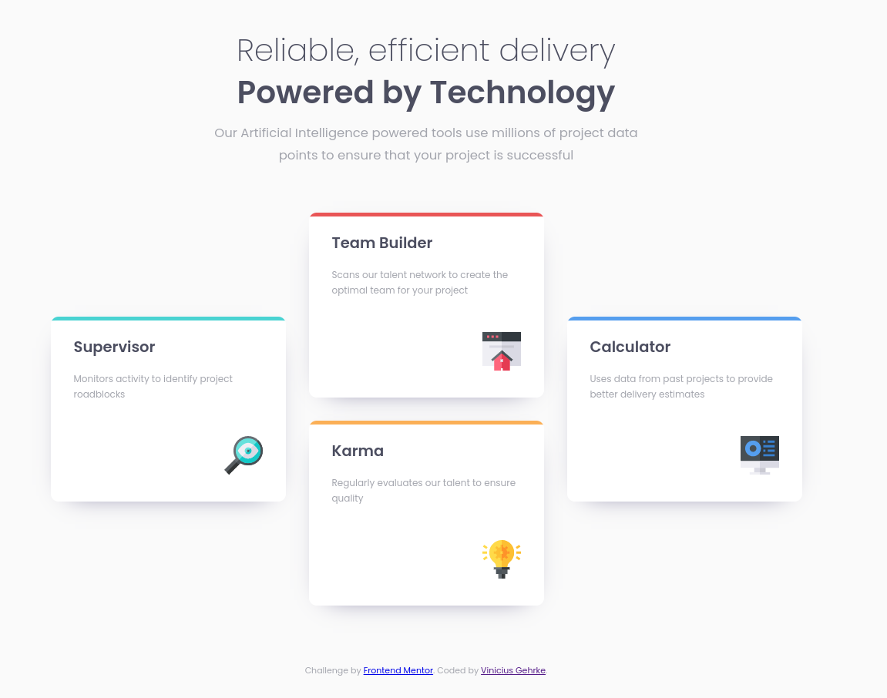

# Frontend Mentor - Four card feature section

## What I learned in this project

* Put in practice multiple box-shadows including a inset shadow that is "trimmed" by the container's rounded border.
* Mastered my Flexbox skills with flex-basis method.
* How to set widht with 'em' under media queries.
* How to properly edit images under IMG tag (inline not a block HTML Element!).
