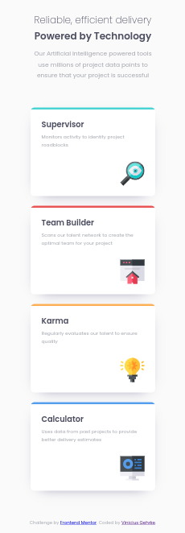

# Four card feature section

Practiced multiple box-shadows including a inset shadow that is 'trimmed' by the container's rounded border.

## What I learned in this project

* Mastered my Flexbox skills with flex-basis method.
* How to set widht with 'em' under media queries.
* How to properly edit images under IMG tag (inline not a block HTML Element!).

Please check the [live website](https://four-card-feature-section-phi-khaki.vercel.app/)

[OnPortfolio](https://front-end-portfolio.vercel.app/)